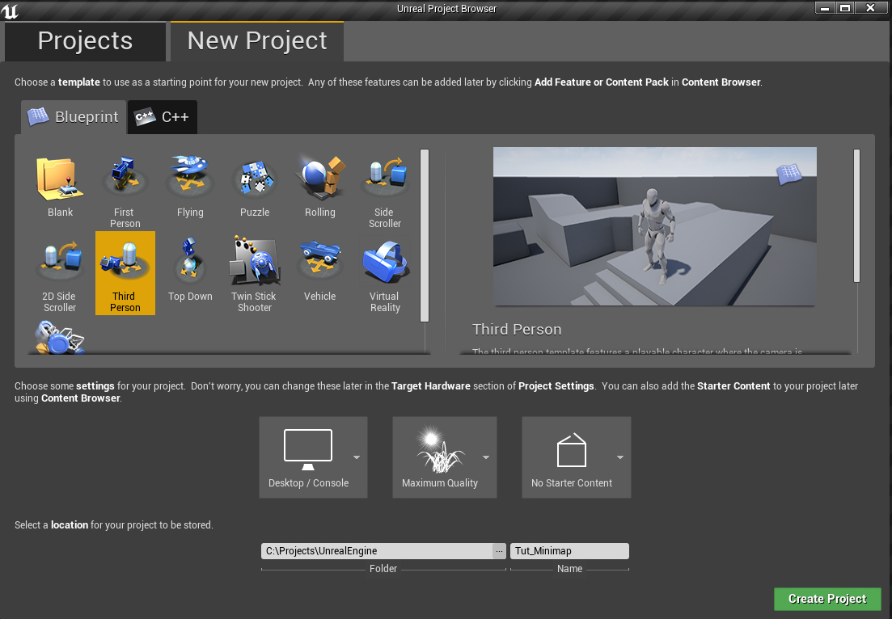
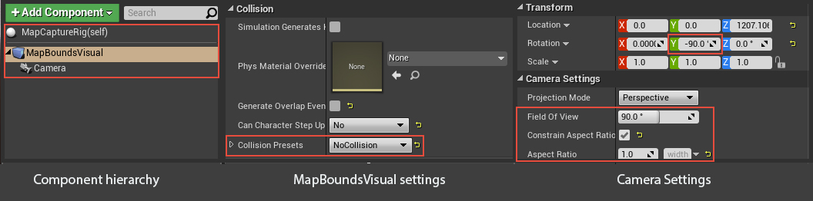
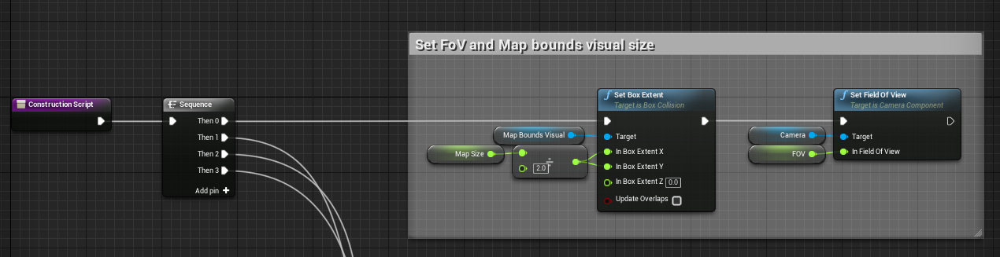
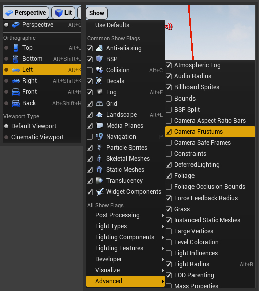
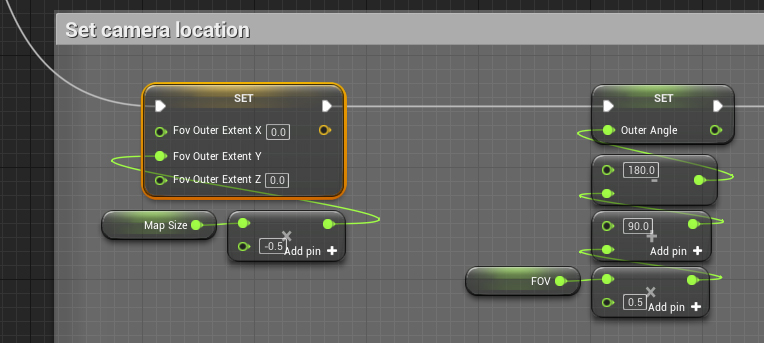
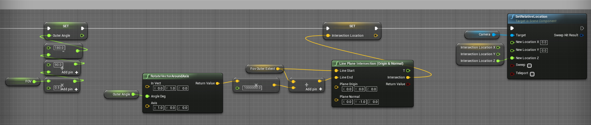

## Introduction

Mini-maps are a necessity for a lot of games and there's some cool solutions already available for Unreal Engine. Generally there are two approaches.

* Realtime rendered mini-map by rendering a camera view to texture.
* Texture based minimap that's editable in image editing software.

The solution we're going to try expand on here is the texture based approach. What I want to focus on here is usability and quick iteration for designers. We'll be creating a rig to automate the process of capturing a game level as a static image and feeding it back into a UMG minimap widget which accounts for the offset of the camera rig position when that position isn't necessarily at world origin.

### Project setup

Lets start by creating a new Blueprint project based on the Third Persoin template. Name it whatever you want, we wont be needing starter content for this tutorial. In the content browser create a new folder at root called **"Blueprints"**.

## Building the map capture rig

### Create initial actor and components

In the blueprints folder, create a new blueprint class extending Actor and call it **MapCaptureRig**.

Open up our new blueprint actor now, we're going to add a couple of components.

* **MapBoundsVisual**: A _Box Collision_ component to visualize the bounds of our map when capturing our map image.
* **Camera**: A camera component as a viewpoint to capture our image from.

In the components panel, add a new _Box Collision_ component and name it **MapBoundsVisual**. Drag the component on top of the **DefaultSceneRoot** component to replace it as the scene root. Select our new root component and in the details panel set it's _Collision Presets_ dropdown to _NoCollision_.

Add a new a **Camera** component. In the cameras details panel set the _Rotation: Y_ to _-90.0_ degrees, _Constrain Aspect Ratio_ to _true_ and _Aspect Ratio_ to _1.0f_ as we'll be rendering our mini-map as a square image.

### Set up control variables

We want to make capturing out map to an image as simple as possible so we'll have two primary variables to control the image capture.

* **MapSize**: A float to set the size of the map bounds to render.
* **FOV**: A float to set the camera Field of View.

Create the above variables. Set **MapSize** default value to _1000.0_ and **FOV** to 45.0. Tick _Instance Editable_ in the details panel for each variable to make these variables editable in when we place our actor in the level.

Now, in the construction script, drag in a reference to **MapBoundsVisual**, and call it's _Set Box Extent_ function. Set it's _X and Y extents_ to **MapSize** / _2_.

Drag in a reference to **Camera** and set it's _Field Of View_ to **FOV**.

Connect these function calls to the _Construction Script_ event through a sequence node to keep things tidy later on.

Now would be a good time to add our rig to the level. Drag **MapCaptureRig** from the content browser into the level, keep it close to the center of the level geometry. With the actor selected in the level you should see your exposed **FOV** and **MapSize** variables exposed in the actors details panel. Have a play around, you should see the **MapBoundsVisual** component resizing.

### Getting the camera position

Now for the fun part. We're going to set the camera position to perfectly frame the MapBoundsVisual box component. As our camera is always above the level looking directly down so we can simplify this process by working with the camera as if it's a 2D triangle when viewed from the left viewport. To make more sense of this set your viewport to _Left_, then in the viewport click _Show->Advanced->Camera Frustums_.

We want to find the position the camera should be in to frame the map bounds. The only information we have right now is the MapSize and the FoV of the camera in degrees.

Because the camera is facing directly downwards we can divide the cameras frustum triangle in 2 to get a right angle triangle. Now we know 2 angles the 90.0 degree angle of the half frustum and the half the field of view from the camera. We get the third angle by adding the two angles we know and subtracting from 180 degrees. _180.0 - (90.0 + 45.0) = 45_.

Create a local variable and call it _FovOuterExtent_ and drag a _set_ node for it into the graph. Right click on the input pin and split it, then set it's _Y_ value to _**MapSize** \* -0.5_. This gets us a point on the extent of our map bounds.

Create another local variable called **OuterAngle**, and set it to:
_180 - ( ( **FOV** / 2 ) + 90)_.

Connect these two nodes to the second pin opn the sequence node we made earlier.

Create another local variable called **IntersectionLocation**, it's input pin to **OuterAngle**s output.

We'll be projecting a line from the **FovOuterExtent** at an angle of **OuterAngle** which gives us the direction to our camera. Then we'll perform a _Line Plane Intersection_ with a plane at our actors origin facing towards the outer extent. The point at which the line intersects with the plane is our camera position.

